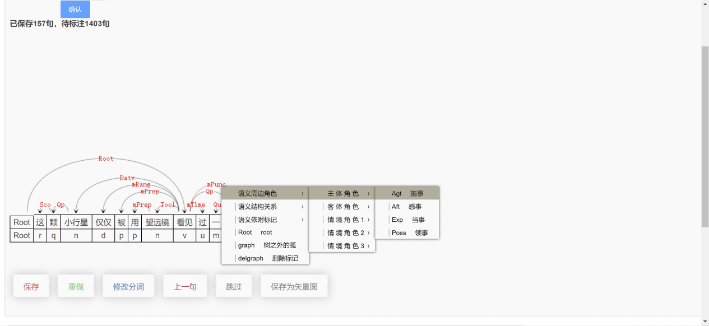

 1语义依存图标注概述
=======================

1.1语义分析概述
---------------

语言具有三个重要层次：音、形、义。“音”指语音，是语言的声音表现形式；“形”主要指句法，是语言的构造方式；而“义”则为语义，代表语言的意义。这三个层面中，意义是最重要的一个层面，没有“意义”的语言是没有价值的，因为如果没有了意义，无论声音还是形体，都无法用其来进行交流，语言也就失去了价值。尤其对于汉语来讲，汉语的语法特性是以意义为基础、以语序以及虚词的运用为主要语法手段、以音律为辅助手段的。汉语语序灵活，以意义作为排列依据。传统的仅将句子分成若干个句法成分的句法研究在分析句子意义时是有一定局限性的，句义研究仅靠句法研究是不够的。多年来，人们对语音和句法的研究取得了很大的进展，但如何对语义知识进行表达与获取，一直都还是个难题。自然语言处理的核心任务就是使计算机能够像人一样知道每个词、每个句子、每个段落的“意思”，如何对语义知识进行正确表达和自动分析则是必经之路。

对句子进行语义分析，简单地说，就是指根据句子的句法结构和句中每个词的词义信息，将句子转化为某种可以表达句子意义的形式化表示。语言学界在面向自然语言处理的语义分析领域，也有多种知识描述形式的探索，包括语义分类、语义特征、语义聚合关系、语义组合限制等。目前在句义方面的研究主要集中在语义角色标注（Semantic Role Labeling,SRL）这种浅层语义分析的任务上，这种浅层语义分析对句子意义的理解不够深入，存在一定的局限性，进行更深层次的语义分析才是真正理解句义的唯一途径。

相较于语义角色标注，语义依存分析属于更深层次的语义分析。语义依存分析（Semantic Dependency Parsing）是建立在依存理论基础上的深层语义分析。它是一种融合了句子中的依存结构和语义信息的语义分析方法，更好地表达了句子的结构与语义关系。语义依存分析提取句子中所有的修饰词与核心词对间的语义关系，句子中的每一个词都有其核心节点（除了整个句子的核心节点外）。语义依存分析是处理词级别、短语级别、从句级别以及句子级别的语义结构的过程，是面向整个句子的深层分析，并且还含有非主要位于包含的语义信息，如数量（quantity）、属性（attribute）等。

对于语义依存分析，我们经历了由依存树结构向依存图结构发展的过程。语义依存树是单一父节点、无环、连通、可投射的，符合依存理论的四条公理。但是真实语言现象中经常会出现某个词语同时依存多个词语，即同时和句中其他多个词语发生语义关联从而拥有多个父节点的现象；也可能出现依存弧相互交叉的非投射现象。这些现象是传统的依存树结构无法表达的。为了将这些真实存在的语言现象显现出来，同时还能兼顾依存表达的优势，我们突破了原有的依存树结构表达的限制，提出了语义依存图结构。即在标注过程中，只要句子中的词与词之间存在语义关系，就将这两个词语节点用依存弧进行连接。

本规范将对语义依存图理论进行详细解释并介绍相应的语料库构建情况，同时对于标注细则进行全面的描述。一方面希望能够对语义知识进行全面而有效的描述；另一方面也希望能为提高机器自动语义标注提供更好的标注知识，从而提高语义自动标注的性能。

1.2相关理论简介
---------------

在语义依存图语料库建设过程中，用到的语言学理论以语义依存理论为主，兼参考谓词论元结构。

语义依存分析是绝对基础，主要是对语义事件进行依存关系分析。第一版语料库的标注全部都是基于语义依存关系的。后来，对数量庞大的语义依存关系标签进行粒度上的提升，形成了粗细两层标注颗粒度，其中粗粒度标注粒度主要是分析某一语义事件的谓词-论元结构，并对这个结构进行依存标注，也即对于一些依附性的成分进行了简化处理。所以说，理论基础仍然是语义依存理论，但是在粗粒度标注框架中，涉及到了对谓词-论元结构的分析与标注。

下面是对这两种语义理论的介绍。

### 1.2.1语义依存图理论简介

为了如何让计算机更好的理解人类自然语言所表达的丰富含义，我们采用语义依存图结构表达中文句子内部的语义依存关系。

语义依存分析是建立在依存语法（Dependency Grammar，DG）基础上，依存语法描述了句子中词与词之间的依存结构，法国语言学家Robinson将依存语法总结为以下四个公理：

1.  一个句子中只有一个成分是核心成分；

2.  其他成分直接依存于某一成分；

3.  任何成分不能依存于两个或两个以上的成分；

4.  依存成分之间不能有交叉。

相应地，语义依存分析是分析句子中所有词与词之间的结构关系以及有结构关系的词对间的语义关系，也即句子中的任何词语都有其父节点（整个句子的核心成分除外）它面向整个句子以及句子中所有的词。

> 例如：鲁迅写的《故乡》是一篇好文章。（root，是）

语义依存图标注结果如下图所示：第一个图是粗粒度[^1]标注标签示例，第二个图是细粒度标注标签示例。

[^1]: 图例：大写英文字母代号为粗粒度标注标签，首字母大写代号为细粒度标注标签，后文有详细解释。

图 1语义依存图示例1（粗粒度）

图 2语义依存图示例2（细粒度）

从例子中可以看出，一个句子经过了语义依存分析后，既可以得到句子的结构信息，比如知道了词与词的相互依存（如“好”依存于“文章”），短语和词的依存等（“一篇好文章”依存于“是”）；也可以得到语义信息，包括谓词和论元间的语义信息[^2]（如“是”和“文章”间的语义关系是类指关系Clas），也包括短语内部的语义信息（如“一篇”和“文章”是名量关系）。经过了语义依存分析后，一个句子被彻底“解构”，被彻底“分析”，是一种真正的深层语义分析。

[^2]: 语义信息：对于各种语义信息的名称如属事、类事和英文代号以及实际所指，后文有详细解释。

以往的语义依存研究大多基于依存树进行分析，但是根据大规模真实语料的实际，同时也考虑到中文灵活多变，经常出现连动、兼语、概念转位等现象，我们的标注结构从原来的依存树结构改为依存图结构。举例来说，现代汉语中经常会出现句子中的某个词语可以和句中多个词语发生语义关联的现象，间隔的词语对之间也会出现交叉关联的情况。例如：我有个妹妹很能干。从依存树分析的结果来看，“妹妹”的父节点是“有”表属事关系，但是“能干”与“妹妹”之间也有语义关系，却没有被标识出来。再比如：她心情不好，不愿意说话。依存树的分析中“她”的父节点是“心情”表示领属关系，但是“说话”与“她”之间也存在表示施事的语义关系，却没有表示出来，因此，语义依存树结构对汉语语义的刻画还存在一定局限性。

正是由于依存树结构在汉语语义研究上存在的不足，在体系结构设计方面，我们运用更加坚实的理论基础，结合汉语本身的特点和依存分析处理语言的优势，我们对依存树结构进行扩展，提出语义依存图体系。在依存图体系的标注中，打破了原来的树的标注限制，允许某个标注成分有多个父亲节点，允许不同的标注弧之间存在交叉，即只要句子中的词与词之间存在语义关系，就将它们相连接。

> 例如：他把杯子打破了。（root，打）

语义依存图结构分析结果如下：

图 3语义依存图示例3（粗粒度）

图 4语义依存图示例4（细粒度）

从例子中可以看出，这个句子经过了语义依存图分析后，“杯子”与“打”和“破”两个词语都有语义关系，即词语“杯子”存在两个父亲节点：“打”和“破”，分别表示受事和当事；另外，弧（打-\>他）与弧（破-\>杯子）也形成了交叉。从句意理解的角度来看，这样的多父亲节点和交叉弧都有其表达语义的真实价值，如果用依存树来表达，语义表达上就会不全面：以“打”为全句核心，依存树的语义标注情况为：（打-\>他，Agt),（打-\>杯子，Pat），（杯子-\>把，mPrep），（打-\>破，eResu），（破-\>杯子，Exp），（破-\>了，mTone），从而丢掉了“杯子”和“破”之间存在的真实语义关系。

通过对大量语言事实的分析和研究，我们在这里对传统的Robinson依存理论中所规定的公理进行了部分修订，突破了原有的依存树的局限性，构建依存图，以增强依存表达的生命力。依存图结构遵循如下公理：

1.  一个句子中只有一个成分是核心成分（唯一根节点）；

2.  其他成分直接依存于某一个成分；

3.  任何一个成分可以同时依存于两个或两个以上的成分（多父节点）；

4.  如果A成分直接依存于B成分，而C成分子啊句中位于A和B之间，那么C可以依存于A左边的成分或B右边的成分，即允许依存弧之间发生交叉（非投射）；

可见，语义依存图分析体系是对缘由语义分析理论的继承和发展，继承了依存树结构的核心思想（规则1和2），打破了语义依存树结构的限制（规则3和4）。

### 1.2.2谓词-论元结构简介

人类所有的语言在它们的语义结构的核心部分都有一种谓词论元排列的形式，叫做“谓词论元结构”（Predicate-argument Sturcture）。这种谓词论元结构表示了隐藏在构成句子的单词和短语的成分的底层之下的各个概念之间存在着的特定关系。

句子中必须包含或隐含谓词信息，而每一个谓词对应着一个或几个事件，事件的参与者就是它的论元。例如“张三走了”，“张三”就是谓词“走”的论元。

1.3语义依存图语料库建设
-----------------------

我们构建了两版语义依存分析语料库：BH-SDP-v1：第一版标注了1万句语义依存树库。采用了先自动转换CPB的语料，再进行人工标注的方式；BH-SDP-v2：第二版构建了一个包含2万个句子的语义依存图库，所有句子均为人工标注。这些语料都来自于不同的领域，包括新闻语料（10068）、中小学语文课本（10038）、新浪微博语料（5000）和用于机器翻译的语料（4900）。其中，微博语料的标注结果还有待进一步优化。

在标注过程中，也尝试了不同的词性规范体系，包括CTB（Chinese Penn Tree Bank）的词性体系和北京大学计算语言学研究所人民日报词性标注体系（PKU）。不同来源的数据的句子长度，词次和词性体系如下表所示。

表格 1第一版语料基本统计

|                    | 句子数量 | 词数量 | 句子平均长度 | 词性体系 |
|--------------------|----------|--------|--------------|----------|
| 新闻语料           | 10068    | 308383 | 30.63        | CTB      |
| 中小学语文课本语料 | 10038    | 101140 | 13.44        | CTB      |
| 微博语料           | 5000     | 160880 | 16           | CTB&PKU  |

1.4标注单位及内容
-----------------

### 1.4.1标注单位 

在标注时，将以句号、问号、惊叹号作为标注单位的分隔标志（类似于标题自成一行也可以作为一个标注单位）。每一个标注单位只含有一个独立的节点（即没有父节点的节点）。
试看以下几个例句：

> 1. 唱歌释放的是自己的感情。

> 2. （拔刀）有杀气！

> 3. 陋室空堂，当年笏满床；衰草枯杨，曾为歌舞场。

> 4. 走惯了远路的三毛唱道：“远方有多远，请你告诉我！”

例1来自中小学语文课本，以句号分隔成为一个标注单位。例2来自剧本，以冒号之后的语录作为标注单位，对于括号内部的状态修饰语也是待标内容。例3是来自《红楼梦》的古诗词，我们把句号分开的句子作为一个待标语句。例4是余秋雨的散文，其中涉及到了直接引语，直接引语作为一个整体，与说话人一起，作为一个标注单位。

### 1.4.2标注成分

标注成分是分词结果，每一个切分单位为一个标注成分，包括词和标点。采用的分词工具是哈工大语言云LTP。

例如：

> 1.张/老师/给/学生/讲/历史/。/

此句中的标注成分为：张，老师，给，学生，讲，历史，以及句号“。”，共计7个标注成分。

> 2.老师/是/新/来/的/，/不/知道/英子/的/情况/。/

此句中的标注成分为：老师，是，新，来，的，逗号“，”，不，知道，英子，的，情况，句号“。”共计12个标注成分。

### 1.4.3标注内容

标注内容是每两个标注成分之间的语义依存关系，包括以下两个部分：

（1）二者之间的管辖关系。即确定两个标注成分谁是中心成分，即父节点，谁是被辖（或称依存、修饰）成分，即子节点，它们之间存在一个依存弧，该弧的方向是由父节点指向子节点。

（2）二者之间的语义关系。它们由语义角色表示，例如施事、受事、当事、方式、时间、处所等，对于语义上并不存在关系只在句法上有关系的标注成分，须标上依附标记。

简而言之，标注内容主要指二元弧连接两个标注成分，以及两个标注成分之间的语义关系。

1.5标注工具
---------------------

我们建立的网络在线标注工具，不仅免去标注工具的安装过程和标注工作语料分配回收过程，增加了工具使用便捷性。另外，在线标注工具增添了网络同步查询和修改等功能，增加了标注者之间的实时沟通。并方便标注管理者随时检查标注情况。标注工具包括的主要功能如下：

1）
修改句子分词错误。出现分词错误时，先点击按钮进入分词修改模式，修改分词，分词被修改后，依存树自动做相应修改。当分词修改完毕，需要用户点击按钮返回依存标注模式，再对分词被修改的部分重新标注依存关系。程序自动检查分词被改动的句子必须保持原句内容不变。

2）
修改句子词性标记错误。词性出现错误，也需要先进入分词修改模式，然后在错误词性上右键，从显示的词性列表中选择正确的词性即可。词性修改句子的依存结构保持不变。词性修改后仍需点击按钮返回依存标注界面。模式的切换，保证了依存标注流程的完整性，保证分词与词性修改的正确性。

3）
语义依存标注。依存标注分别左键点击两个词语，系统会自动在两个词语之间连接依存弧，弧的方向从第一个词指向第二个词。系统会默认给出弧的语义标签，如果标签错误，右键点击标签，再从弹出的标签列表中选择正确的语义标签即可。提交时，系统会自动检查标注完整性，也会做必要的错误检查，如果不满足依存图条件，系统给出相应错误提示。如果标注正确，系统则顺利提交并自动跳转到下一个句子。必要的错误检查包括，原句子是否被改变；是否每一个词都有父亲节点；是否每一条弧关系都具有依存关系；是否出现依存环结构。

4）
查询标注历史，并修改错误句子。点击标注界面右上角历史记录，即可进入标注历史显示页面。标注者可以检查自己历史标注情况，如果发现标注错误，可以点击句子进入修改页面进行修改。

5）
按关键字搜索已标注数据。搜索功能可以按句子关键字、语义标签、词性、标注时的备注及它们的组合进行搜索，搜索范围是自己的标注历史。对搜索返回的句子，同样可以点击句子进入修改页面进行修改。搜索功能方便标注者针对某一类错误进行查询和修改。另外，系统还提供在全部已标注数据中搜索以上内容，方便标注者针对标注中的疑问，从别人的标注数据里学习。但是这种搜索不能对搜索返回的句子进行修改。搜索界面如图19所示。

6）
管理员管理标注人员标注情况。管理员使用超级账号登陆后，系统会按管理员需求在每个标注者标注的句子中随机抽取一定数量的句子供管理员检查，管理员可以为每个句子标记是否标注正确并备注错误信息。这些信息系统会反馈给相应标注者。

标注工具的页面如下图所示：

图 5标注工具示例

1.6标注步骤
-----------

为保证标注规范的客观性以及标注的一致性，我们建议有以下六步操作规范：

1.  确定标注单位是否由多个事件(非紧缩句)组成，确定每个事件的中枢概念，或核心谓词；

2.  确定事件和事件间的语义关系，如并列、选择、假设等事件关系，若为单一事件，则略过此步骤；

3.  确定事件中与中枢概念相关的语义角色，包括所有的主体角色、客体角色以及情境角色；

4.  确定事件中与核心指称概念相关的语义角色，包括情境角色，以及事件中出现的反关系和嵌套事件关系

5.  确定标注单位中的语义依附标记，包括标点标记和所有的依附标记；

6.  整体检查：有无漏标、错标等现象。

1.7标注意义及难点
-----------------

当下的自然语言处理研究，统计方法处于主体地位，但是要想让统计方法发挥优势，必须有大规模的人工标注的语料库作为支撑。因此，基于统计的语义依存分析研究，也必须有大规模的语料库资源。所以，我们需要花费一定的人力、物力，进行语义依存资源的建设。而且，以往的经验告诉我们，大规模高质量的语料库资源往往能够极大地推动研究方向的进展。所以想要推广语义依存分析研究，也必须配以相应的语料库资源。

标注过程中，难点主要在于如何贯彻标注的一致性。标注一致性是衡量语料质量的重要指标，语料的自动标注对自动分析器十分重要。语义依存标注的一致性体现在相同的语言现象被标注为相同的依存结构。相同的依存结构指依存弧和依存关系都一致。我们进行过标注一致性实验，标注者在标注语料时很大程度上都取得一致结果。但是，仍然会存在某些词语对可标注多种依存关系的情况。所以，我们在制订标注规范的时候，会对不同依存关系的边界划分制定规则，使区分更加清晰。

难点之二在于对于汉语的复杂性。首先是结构的复杂性，汉语有并列、兼语、连动、比较等特殊结构，对于不同的结构，需要具体问题具体分析，要尽量将结构义表达出来。其次是口语语料的稀疏性。这是一个很宽泛的概念，剧本语料涉及到的口语语料、汉语中的一些谚语、俗语、歇后语等，都可以归入此类。比如说，俗语“碰钉子”与动宾短语“碰钉子”的含义不同，前者的含义是“比喻遭到拒绝或者斥责”，而后者是一个短语，“碰钉子”表达的是“碰到了钉子上”，在标注的时候，要将这一类情况进行区分。再比如，一些口语中的提示性话语，例如“你看”，有时候，“你看”并不是表达真正的“看”，而是提醒听话人注意接下来的内容，对于这样的情况，我们也要区别对待。

所以，针对这种情况，我们在本规范的第七章，对于各种特殊情况给出专门的标注细则，一方面能够指导标注工作，另一方面也是对语言知识的总结。
